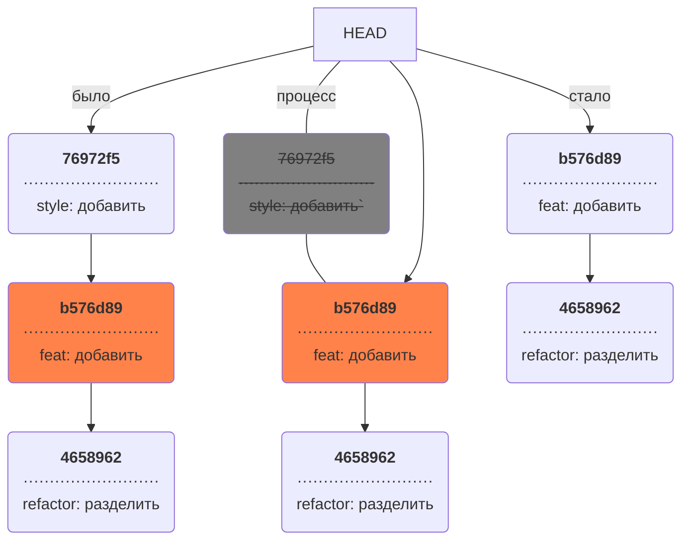

### `git restore --staged <file>` — выполнить unstage изменений

```BASH
$ touch example.txt # создали ненужный файл
$ git add example.txt # добавили его в staged

$ git status # проверили статус
Changes to be committed:
  (use "git restore --staged <file>..." to unstage)
        new file:   example.txt

$ git restore --staged example.txt
$ git status # проверили статус

Untracked files:
  (use "git add <file>..." to include in what will be committed)
        example.txt

no changes added to commit (use "git add" and/or "git commit -a")
# файл example.txt из staged вернулся обратно в untracked 
```

Вызов `git restore --staged example.txt` перевёл `example.txt` из `staged` обратно в `untracked`.

Чтобы «сбросить» все файлы из `staged` обратно в `untracked`/`modified`, можно воспользоваться командой `git restore --staged .`: она сбросит всю текущую папку (`.`).

### `git reset --hard <commit hash>` — «откатить» коммит

```BASH
$ git log --oneline # хеш можно найти в истории
7b972f5 (HEAD -> master) style: добавить комментарии, расставить отступы
b576d89 feat: добавить массив Expenses и цикл для добавления трат # вот сюда и вернёмся
4b58962 refactor: разделить analyzeExpenses() на countSum() и saveExpenses()

$ git reset --hard b576d89
# теперь мы на этом коммите
HEAD is now at b576d89 feat: добавить массив Expenses и цикл для добавления трат 
```

Теперь коммит `b576d89` стал последним: вся дальнейшая разработка будет вестись от него. Файл также вернулся к тому состоянию, в котором был в момент этого коммита. А коммит `7b972f5` Git просто удалил. Это можно проверить, снова запросив лог. Он покажет следующее.

```BASH
$ git log --oneline
b576d89 (HEAD -> master) feat: добавить массив Expenses и цикл для добавления трат
4b58962 refactor: разделить analyzeExpenses() на countSum() и saveExpenses() 
```

Вот так схематично выглядит весь процесс «отката» с помощью `git reset --hard <hash>`.





Будьте осторожны с командой `git reset --hard`! При удалении коммитов можно потерять что-то нужное.
### `git restore <file>` — «откатить» изменения, которые не попали ни в staging, ни в коммит


```BASH
# случайно изменили файл example.txt
$ git status
On branch main
Changes not staged for commit:
  (use "git add <file>..." to update what will be committed)
  (use "git restore <file>..." to discard changes in working directory)
          modified:   example.txt

$ git restore example.txt
$ git status
On branch main
nothing to commit, working tree clean 
```

Изменения в файле «откатятся» до последней версии, которая была сохранена через `git commit` или `git add`.