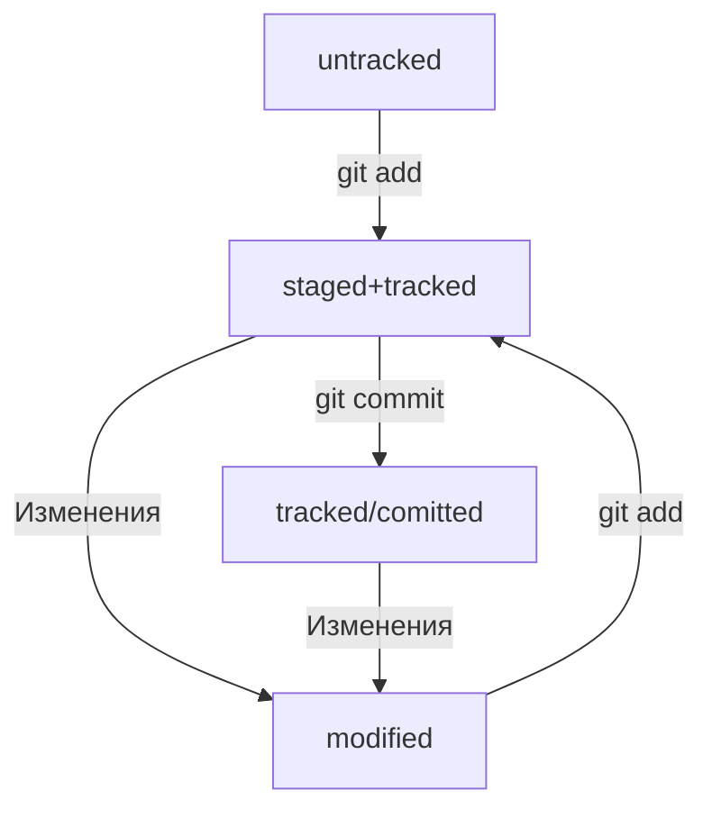

Одна из ключевых задач Git — отслеживать изменения файлов в репозитории. Для этого каждый файл помечается каким-либо статусом. Рассмотрим основные.

### **`untracked`**
Новые файлы в Git-репозитории помечаются как `untracked`, то есть неотслеживаемые. Git «видит», что такой файл существует, но не следит за изменениями в нём. У `untracked`-файла нет предыдущих версий, зафиксированных в коммитах или через команду `git add`.

### **`staged`**
После выполнения команды `git add` файл попадает в **staging area** , то есть в список файлов, которые войдут в коммит. В этот момент файл находится в состоянии `staged`.


>[!faq]  **Staging area, index и cache**
>Staging area также называют **index** (англ. «каталог») или **cache** (англ. «кеш»), а состояние файла `staged` иногда называют `indexed` или `cached`.
>
Все три варианта могут встречаться в документации и в качестве флагов команд Git. А также в интернете — например, в вопросах и ответах [на сайте Stack Overflow](https://stackoverflow.com/).

### **`tracked`**
Состояние `tracked` — это противоположность `untracked`. Оно довольно широкое по смыслу: в него попадают файлы, которые уже были зафиксированы с помощью `git commit`, а также файлы, которые были добавлены в staging area командой `git add`. То есть все файлы, в которых Git так или иначе отслеживает изменения.
### **`modified`**
Состояние `modified` означает, что Git сравнил содержимое файла с последней сохранённой версией и нашёл отличия. Например, файл был закоммичен и после этого изменён.

>[!tip]
>Для файлов в состояниях `staged` и `modified` обычно не указывают, что они также `tracked`, потому что это состояние подразумевается.

## Про `staged` и `modified`
Команда `git add` добавляет в staging area только текущее содержимое файла. Если вы, например, сделаете `git add file.txt`, а затем измените `file.txt`, то новое содержимое файла не будет находиться в staging.

Git сообщит об этом с помощью статуса `modified`: файл изменён относительно той версии, которая уже в staging. Чтобы добавить в staging последнюю версию, нужно выполнить `git add file.txt` ещё раз.

## Типичный жизненный цикл файла в Git




1. Файл только что создали. Git не отслеживает содержимое. Состояние: `untracked`.
2. Файл добавили в staging area с помощью `git add`. Состояние: `staged` (+ `tracked`).
    - Возможно, изменили файл ещё раз. Состояния: `staged`, `modified` (+ `tracked`).    `staged` и `modified` у одного файла, но у разных его версий.
    - Ещё раз выполнили `git add`. Состояние: `staged` (+ `tracked`).
3. Сделали коммит с помощью `git commit`. Состояние: `tracked`.
4. Изменили файл. Состояние: `modified` (+ `tracked`).
5. Снова добавили в staging area с помощью `git add`. Состояния: `staged` (+ `tracked`).
6. Сделали коммит. Состояния: `tracked`.
7. Повторили пункты 4−7 много-много раз.

### Какие состояния показывает `git status`
Большинство файлов в проекте находятся в состоянии `tracked`. Вы не увидите это состояние в выводе команды `git status` — иначе она бы каждый раз выводила список всех файлов проекта.
`git status` показывает только следующие состояния файлов:

- `staged` (`Changes to be committed`);
- `modified` (`Changes not staged for commit`);
- `untracked` (`Untracked files`).

### Типичные варианты вывода `git status`

#### 1. **Нет ни `staged`-, ни `modified`-, ни `untracked`-файлов.**
```BASH
$ git status
On branch master
nothing to commit, working tree clean 
```
#### 2. **Найдены неотслеживаемые файлы.**
```BASH
$ touch fileA.txt
$ git status
On branch master
Untracked files: # найдены неотслеживаемые файлы
  (use "git add <file>..." to include in what will be committed)
        fileA.txt

nothing added to commit but untracked files present (use "git add" to track)
```
#### 3. **Найдены изменения, которые не войдут в коммит**
```BASH
# внесли в fileA.txt правки
# запросили статус
$ git status 
On branch master
Changes not staged for commit: # ещё одна секция
  (use "git add <file>..." to update what will be committed)
  (use "git restore <file>..." to discard changes in working directory)
        modified:   fileA.txt
```
#### 4. **Найдены изменения, которые войдут в коммит**
```BASH
$ git add fileA.txt
$ git status
On branch master
Changes to be committed: # все изменения готовы к коммиту
  (use "git restore --staged <file>..." to unstage)
        modified:   fileA.txt
```
#### 5. **Файл добавлен в staging area, но после этого изменён**
```BASH
# изменили fileA.txt
$ git status
On branch master
Changes to be committed:
  (use "git restore --staged <file>..." to unstage)
          modified:   fileA.txt

Changes not staged for commit:
  (use "git add <file>..." to update what will be committed)
  (use "git restore <file>..." to discard changes in working directory)
          modified:   fileA.txt
```